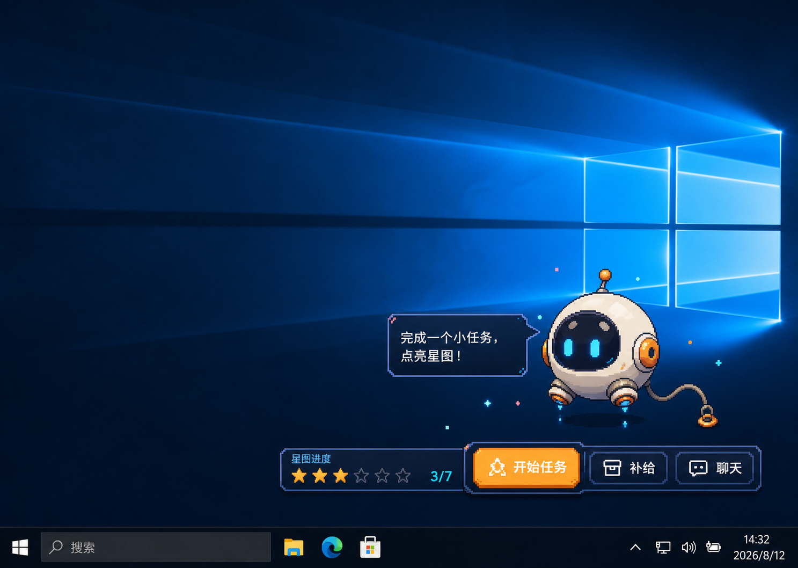

# OrbitBit · 轨道团子

OrbitBit 是一只生活在 Windows 桌面上的原创开源像素宇航员。完成一个微小任务，点亮一颗星；需要专注时，它也会安静地陪在你身边。



## 为什么做 OrbitBit

- **安静陪伴：** 桌面版采用真正透明的置顶窗口，默认只显示角色和极简状态，不遮挡工作内容。
- **健康黏性：** 通过触碰回应、专注陪伴和点星仪式建立情感连接，不使用断签惩罚、愧疚提醒或虚假紧迫感。
- **微任务循环：** 每完成一件短小、安全的任务，就点亮七星图中的一颗星。
- **自由缩放：** 拖动右下角把手即可调整大小，也可在托盘菜单选择“小巧 / 标准 / 舒展”；大小会在下次启动时恢复。
- **本地优先：** 进度保存在设备本地，不需要账号，也不收集遥测数据。
- **便于贡献：** 角色素材、壁纸、任务内容、状态逻辑和渲染外壳相互分离，方便社区扩展。

## 本地运行

环境要求：Windows 10/11，以及 Node.js 22.12 或更高版本。

```bash
npm install
npm run dev:desktop
```

浏览器设计预览：

```bash
npm run dev
```

## 测试与打包

```bash
npm test
npm run build
npm run build:app
```

Windows 便携版可执行文件会生成到 `release/` 目录。

## 添加任务包

任务内容遵循 [`plugins/starter-pack.json`](plugins/starter-pack.json) 中的 JSON 结构。任务包需要声明唯一标识、作者、陪伴消息和任务列表。请保持任务标识稳定，并在提交拉取请求时附带测试或验证说明。

## 灵感与原创性

OrbitBit 的灵感来自桌面宠物这一产品类别，以及 [VPet](https://github.com/LorisYounger/VPet) 所展示的社区扩展潜力。OrbitBit 采用独立净室实现，不复制或再分发 VPet 的源代码、名称、标志、角色美术或动画文件。本仓库中的 OrbitBit 角色、图标和壁纸素材均为本项目原创，并随仓库采用 MIT 许可证发布。

## 参与贡献

欢迎提交 Issue 和拉取请求。参与前请阅读 [贡献指南](CONTRIBUTING.md)，并遵守 [社区行为准则](CODE_OF_CONDUCT.md)。

## 许可证

[MIT](LICENSE)
